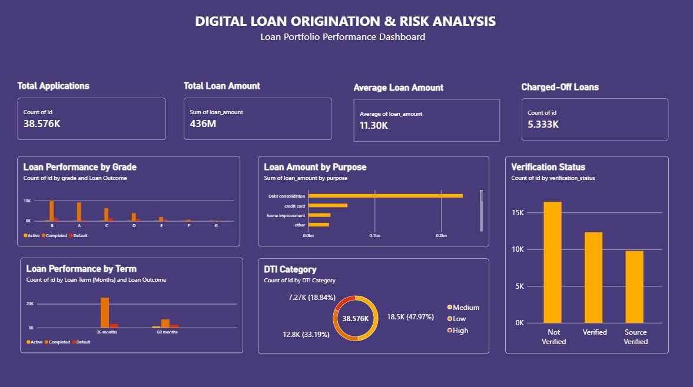

# Digital Loan Origination & Risk Analytics

## Project Overview
A Business Analyst portfolio project focused on analyzing a digital loan portfolio to understand loan performance, risk patterns, borrower characteristics, and portfolio KPIs.

## Business Problem
Banks process large volumes of loan applications and need effective reporting to monitor loan performance, risk, verification status, and repayment patterns.

## Objectives
- Analyze loan portfolio performance
- Identify risk patterns across loan grades
- Analyze loan purpose and repayment terms
- Monitor DTI and verification status
- Build business KPIs and a dashboard

## Loan Origination Process

Customer → Loan Application → KYC → Document Verification → Credit Assessment → Risk Assessment → Approval/Rejection → Disbursement

## Tools Used
- **Excel** – Data cleaning, exploration, KPIs & Pivot Tables
- **MySQL** – Data analysis and SQL queries
- **Power BI** – Interactive dashboard
- **Business Analysis** – Requirements, process flow, business rules, user stories & UAT

## Key KPIs
- Total Applications: **38,576**
- Total Loan Amount: **$435.76M**
- Average Loan Amount: **$11,296**
- Charged-Off Loans: **5,333**
- Charge-Off Rate: **13.82%**
- Fully Paid Loans: **32,145**
- Current Loans: **1,098**

## Dashboard

## Key Analysis
- Loan Performance by Grade
- Loan Amount by Purpose
- Loan Performance by Term
- Borrowers by DTI Category
- Loans by Verification Status
- Overall Portfolio Risk

## Deliverables
- `loan_analysis.xlsx`
- `loan_analysis.sql`
- `loan_dashboard.pbix`
- `BA_Documentation.docx`
- `loan_dashboard_overview.png`

## Disclaimer
This is a portfolio case study created for learning and demonstration purposes. It does not represent work performed for a real banking client.
